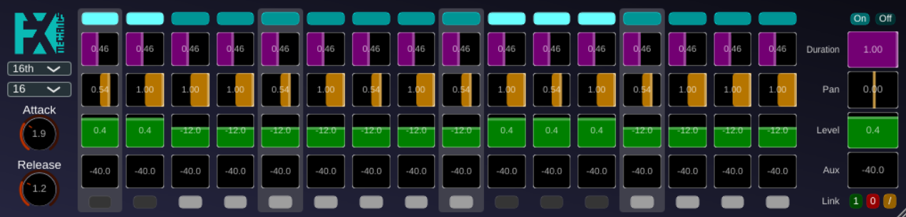

# RhyGa, the Rhytmic Gate

## Description

**RhyGa** is a simple yet versatile rhythmic gate effect for your DAW. It allows us to create tempo-synced patterns by modulating the volume of an incoming audio signal. With per-step controls for level, pan, duration, and an auxiliary send, you can transform static pads into pulsating rhythms, create complex stutter effects on vocals, or add dynamic movement to any track.

## Features

*   **16-Step Sequencer:** Create patterns up to 16 steps long.
*   **DAW Synchronization:** The sequencer stays in time with the DAW's tempo and transport controls.
*   **Flexible Timing:** Choose from various metric subdivisions, including straight, triplet, and 32nd notes.
*   **Dual Stereo Outputs:** A main stereo output and a separate stereo auxiliary output for parallel processing.
*   **Per-Step Controls:**
    *   **On/Off:** Activate or deactivate individual steps.
    *   **Duration:** Control how long the gate stays open for each step.
    *   **Level:** Adjust the volume for the main output.
    *   **Pan:** Position each step in the stereo field.
    *   **Aux Send:** Set the send level to the auxiliary output, perfect for feeding delays or reverbs.
*   **Global Controls:**
    *   **Attack & Release:** Shape the envelope of the gate for smooth or aggressive gating.
*   **Linking System:**
    *   Link steps together to edit their parameters simultaneously.
    *   Quickly turn all linked steps on or off.
    *   Instantly link all, none, or invert the current link selection.
    **Randomize:**
    *   Click on the Fx-Mechanics logo to get lucky!

## Usage Instructions

1.  **Insert RhyGa:** Place RhyGa as an insert effect on the audio or instrument track you wish to process.
2.  **Sync with DAW:** Press play in your DAW. The sequencer will start running, and the currently active step will be highlighted.
3.  **Set the Rhythm:**
    *   Use the **Metric** dropdown (top-left) to select the speed of the steps (e.g., "16th" for sixteenth notes).
    *   Use the **Steps** dropdown to set the length of your pattern (from 2 to 16 steps).
4.  **Create Your Pattern:**
    *   Click the top-most button in each step column to toggle it **On** or **Off**.
    *   For each active step, you can adjust its **Duration**, **Pan**, **Level** (main out), and **Aux** (auxiliary out) using the vertical sliders.
5.  **Shape the Gate:**
    *   Use the global **Attack** and **Release** knobs to control how quickly the gate opens and closes for each step.
6.  **Use the Link Controls for Power-Editing:**
    *   At the bottom of each step is a small **Link** toggle button. Activate it for any steps you want to edit together.
    *   Use the **Master Controls** on the right-hand side to adjust the parameters (Duration, Pan, Level, Aux) for all linked steps at once.
    *   The **On/Off** buttons in the master section will enable or disable all linked steps.
    *   The **"1"**, **"0"**, and **"/"** buttons allow you to quickly link all steps, no steps, or invert the current link selection.
7.  **Aux Output:** If your DAW supports it, you can route the "Aux" output of the plugin to another track to process the gated signal with different effects (e.g., send only certain beats to a delay).

## Contact

olivier.doare@ensta-paris.fr